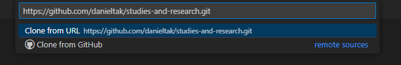
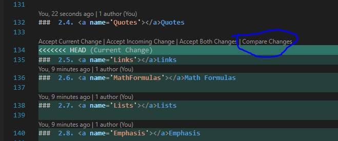

<!-- vscode-markdown-toc -->
* 1. [VSCode](#VSCode)
	* 1.1. [Installation](#Installation)
	* 1.2. [Create clone folder](#Createclonefolder)
	* 1.3. [Git clone](#Gitclone)
	* 1.4. [Extensions](#Extensions)
	* 1.5. [Using the Extensions](#UsingtheExtensions)
		* 1.5.1. [Markdown All in One](#MarkdownAllinOne)
		* 1.5.2. [Markdown TOC](#MarkdownTOC)
* 2. [Markdown](#Markdown)
	* 2.1. [Titles and Subtitles](#TitlesandSubtitles)
	* 2.2. [Codes](#Codes)
	* 2.3. [Links](#Links)
	* 2.4. [Images](#Images)
	* 2.5. [Quotes](#Quotes)
	* 2.6. [Math Formulas](#MathFormulas)
	* 2.7. [Lists](#Lists)
	* 2.8. [Emphasis](#Emphasis)
	* 2.9. [Keyboard](#Keyboard)
	* 2.10. [Tables](#Tables)
* 3. [Git](#Git)
	* 3.1. [Pull](#Pull)
	* 3.2. [Changes](#Changes)
	* 3.3. [Commit](#Commit)
	* 3.4. [Push](#Push)

<!-- vscode-markdown-toc-config
	numbering=true
	autoSave=true
	/vscode-markdown-toc-config -->
<!-- /vscode-markdown-toc -->

#  <a name='Tutorial'></a>Tutorial


This Tutorial document is used to guide the user on how to use VSCode for Windows to write a MarkDown on Github.

An example of how to create a MarkDown document can be found on the [LuisCarlosRojasTorres' github repository](https://github.com/LuisCarlosRojasTorres/Books/blob/main/ComputerScience/UncleBob/CleanArchitecture/Sec04-Components.md)

##  1. <a name='VSCode'></a>VSCode

###  1.1. <a name='Installation'></a>Installation

Install the [VSCode](https://code.visualstudio.com/) for Windows clicking on the following link: [https://code.visualstudio.com/download](https://code.visualstudio.com/download).

###  1.2. <a name='Createclonefolder'></a>Create clone folder

Create a folder on your computer to create the git clone of the repository.

###  1.3. <a name='Gitclone'></a>Git clone

- Login to your account and go to the repository and copy the HTTP clone link, e.g.: `https://github.com/danieltak/studies-and-research.git`

- Open the VSCode software and go to Source Control Panel:


- Click on "Clone Repository", a Command Palette will open, paste the clone http link,  for this project. And then choose the created folder to save the clone.



- Wait while the clone is being loaded.

- A Dialog will show, choose the "Open" clone option.


###  1.4. <a name='Extensions'></a>Extensions

Go to the Extensions panel and search for "markdown".


Install the follwing extensions:

- Markdown All in One
- Markdown TOC

###  1.5. <a name='UsingtheExtensions'></a>Using the Extensions
####  1.5.1. <a name='MarkdownAllinOne'></a>Markdown All in One

The main feature of this extension is the Preview functionality, which allows the user to preview the Markdown as can be seen on the following image:


To enable the Preview Functionality you can press <kbd>Ctrl</kbd> + <kbd>Shift</kbd> + <kbd>V</kbd> or click on the Preview icon:


For further information about this extension, read the [repository documentation](https://github.com/yzhang-gh/vscode-markdown).

####  1.5.2. <a name='MarkdownTOC'></a>Markdown TOC

The extension from Joffrey Kern generates an automatic Table of Contents at the top of the documentation.

To use this feature follow the instructions below:

- Open any markdown file (.md extension)
- Open the command palette <kbd>Ctrl</kbd>+<kbd>Shift</kbd>+<kbd>P</kbd>
- Type "Generate" and choose the command palette "Generate TOC for markdown"


For further information about this extension, read the [repository documentation](https://github.com/joffreykern/vscode-markdown-toc).

##  2. <a name='Markdown'></a>Markdown

The [Gitlab Markdown](https://about.gitlab.com/handbook/markdown-guide/) documentation provides information about the Markdown syntax on Gitlab and what can be used on the platform.

The [official VSCode documentation](https://code.visualstudio.com/docs/languages/markdown) for Markdown explains some native VSCode features, such as the ability to view Document Outline as a tree structure:


The [Github documentation](https://docs.github.com/en/get-started/writing-on-github/getting-started-with-writing-and-formatting-on-github/basic-writing-and-formatting-syntax) has the Basic writing and formatting syntax for markdown.

The [Common Mark Tutorial](https://commonmark.org/help/tutorial/) can be used to learn more about Markdown syntax.

And many other features, however, on our documentation just some markdown syntax will be implemented.

###  2.1. <a name='TitlesandSubtitles'></a>Titles and Subtitles

The Headings starts with a hash `#`, where `#` is the main Title and isn't added to the Table of Contents.

And the Titles and Subtitles starts with two hashes `##` to four hashes `####`, for example the code below:

```md
##  1. <a name='VSCode'></a>VSCode

###  1.1. <a name='Installation'></a>Installation
###  1.2. <a name='Createclonefolder'></a>Create clone folder
###  1.3. <a name='Gitclone'></a>Git clone
###  1.4. <a name='Extensions'></a>Extensions

###  1.5. <a name='UsingtheExtensions'></a>Using the Extensions
####  1.5.1. <a name='MarkdownAllinOne'></a>Markdown All in One
####  1.5.2. <a name='MarkdownTOC'></a>Markdown TOC

##  2. <a name='Markdown'></a>Markdown
```

Becomes the following tree structure:


###  2.2. <a name='Codes'></a>Codes

To create inline code styling, wrap the text between use backticks ` ` `.

Example:

```md
`Your text here`
```

To create code block styling, either indent each line by four spaces or place 3 backticks ` ``` ` on a line above and below your code block, you can also specify your working language at the start after the backticks.

Example with 4 spaces:

```
	#include <iostream>

	int main()
	{
		std::cout << "Hello, world!";
		return 0;
	}
```

Example using backticks:

	```cpp
	#include <iostream>

	int main()
	{
		std::cout << "Hello, world!";
		return 0;
	}
	```
###  2.3. <a name='Links'></a>Links

Links can be either inline with the text, or placed at the bottom of the text as references. Example:

```md
jhjkk
```

Link text is enclosed by square brackets [], and for inline links, the link URL is enclosed by parens (). Example:

`[Link to Github](http://github.com)`

Links can also be enclosed by `<>`, example:

`<http://github.com/>`
###  2.4. <a name='Images'></a>Images

Images are almost identical to [links](#Links), but an image starts with an exclamation point `!`

> Don't write code as images, instead use as text, pictures should be used for non-string content.

###  2.5. <a name='Quotes'></a>Quotes

To create a blockquote, start a line with greater than `>` followed by an optional space.

Blockquotes can be nested, and can also contain other formatting.

Example:

```
> Always code as if the guy who ends up maintaining your code will be a violent psychopath who knows where you live.
> 
> Martin Golding
```

Result:

> Always code as if the guy who ends up maintaining your code will be a violent psychopath who knows where you live.
> 
> Martin Golding


###  2.6. <a name='MathFormulas'></a>Math Formulas

###  2.7. <a name='Lists'></a>Lists

Unordered lists can use either asterisks `*`, plus `+`, or hyphens `-` as list markers.
Ordered lists use numbers followed by period `.` or right parenthesis `)`.

Example with hyphens `-`:

```md
- Lorem
- Ipsum
- Dolar
```

Result:

- Lorem
- Ipsum
- Dolar

Example with numbered list with perioed `.`:

```md
Four steps to Lorem ipsum dolor sit amet, consectet:
1. Ut enim ad minim veniam
2. quis nostrud exercitation ullamco laboris
3. nisi ut aliquip ex ea commodo consequat
4. Duis aute irure dolor in reprehenderit
```

Result:

Four steps to Lorem ipsum dolor sit amet, consectet:
1. Ut enim ad minim veniam
2. quis nostrud exercitation ullamco laboris
3. nisi ut aliquip ex ea commodo consequat
4. Duis aute irure dolor in reprehenderit

Example with when you don't want a list after the period `.`, just the literal period:

```cpp
20. What a great year...

Instead use:

20\. What a great year...
```

Result:

20. What a great year...	

Instead use:

20\. What a great year...

###  2.8. <a name='Emphasis'></a>Emphasis

To create **bold** or _italic_, wrap with asterisks `*` or underscores `_`.

To avoid creating bold or italic, place a backslash in front `\*` or `\_`.

Examples:

```md
*italic* or _italic_

**bold** or __bold__

\**not bold\** or \_not italic\_
```
###  2.9. <a name='Keyboard'></a>Keyboard

To insert keyboard styling input the string between `<kbd>` and `<\kbd>`. Example:

```md
<kbd>Ctrl</kbd> + <kbd>Alt</kbd> + <kbd>Del</kbd>
```

Result:

<kbd>Ctrl</kbd> + <kbd>Alt</kbd> + <kbd>Del</kbd>

###  2.10. <a name='Tables'></a>Tables

To add a table, use three or more hyphens `---` to create each column’s header, and use pipes `|` to separate each column. For compatibility, you should also add a pipe `|` on either end of the row.

Example:

```md
| Header1    | Header 2 |
| -----------| -----------|
| Descrip1   | Item1      |
| Descrip2   | Item2      |
```

Result:

| Header1    | Header 2 |
| -----------| -----------|
| Descrip1   | Item1      |
| Descrip2   | Item2      |

The following web tools could be used to generate a markdown table:

- [Table to Markdown](https://tabletomarkdown.com/generate-markdown-table/)
- [Table Convert](https://tableconvert.com/markdown-generator)
- [Jake Bathman](https://jakebathman.github.io/Markdown-Table-Generator/)

##  3. <a name='Git'></a>Git

The git version control system can be used directly from VSCode, either on the Source Control Panel or using the terminal <kbd>Ctrl</kbd> + <kbd>'</kbd> shortcut.

###  3.1. <a name='Pull'></a>Pull

The first task you need to do before start editing the code is to pull, to update your local repository or a branch and verify if there are conflicts to resolve.

Open the terminal with <kbd>Ctrl</kbd> + <kbd>'</kbd> and write the command `git pull`

- If the following error is shown, commit your changes and try again.

```
error: Your local changes to the following files would be overwritten by merge:
        Tutorial.md
Please commit your changes or stash them before you merge.
Aborting
```
- On a new `git pull` if there are some conflicts on the changes, a Merged Change conflict will appear on the Source Control Panel.


- Solve those conflicts by first comparing and analyzing the differences



- "Resolve in Merge Editor" can be used to resolve the conflicts and then add to Staged Changes and commit again.

###  3.2. <a name='Changes'></a>Changes

- Firstly compare and correct conflicts on the differences from the previous version by clicking on the changed file:


- Later add the changes to the Staged Changes list for Commit.


###  3.3. <a name='Commit'></a>Commit

- Describe your commit on the "Commit description here" Text Box and click on "Commit" to commit the "Staged Changes".


###  3.4. <a name='Push'></a>Push

Click on "Sync Changes" to pull/push the changes to your remote repository.


Or use the `git push` command.